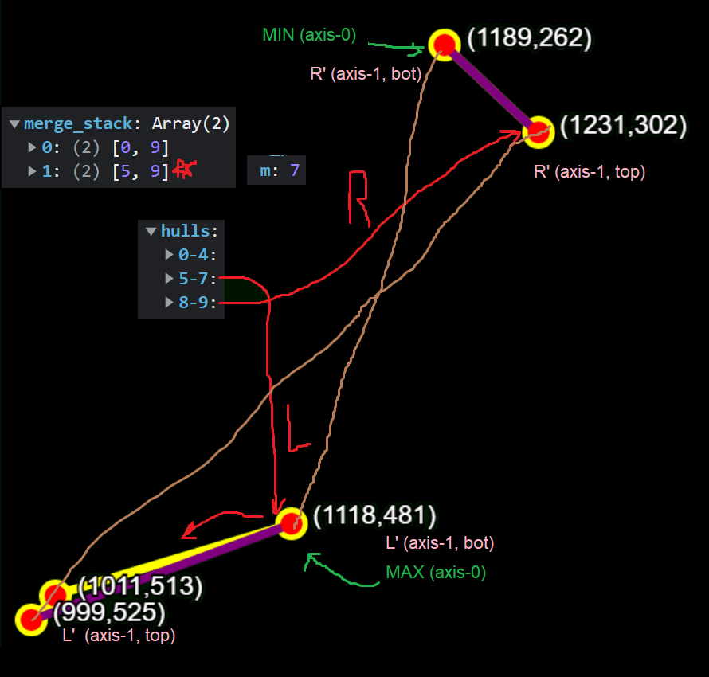

# vis_algo.js
Here I explore all the main types of algorithms found in computing and visualize them for a deeper understanding. A summary from Queen's CISC 352 course.

Credits for the algorthims, herein, go to Dr. James Stewart and the CISC 365 course he instructed at Queen's.

## File Structure:
 - `lib`: contains all libraries used.
 - `algorithmns`: all the algorithms made to power the visualizations.
 - `environments`: shapes and objects used to build the visualized environments.

# Algorithmns and challenges:
Here I go over some of the challenges I faced when developing simulations for each of the algorithmns.

## Divide and Conquer: Iterative Convex Hull
### Challenges:
- *Converting recursive convex hull to iterative*: This was hard to do because the recursive version needed the data from its call stack in order to complete its job of merging. This was solved by having two stacks with two seperate loops to deal with them.
    - Divide loop with divide stack: This was done to divide the points to their elements and generate elemental hulls that would be merged to result in the final convex hull.
    - Merge loop with merge stack: the merge stack was created during the divide process to maintain the order (backtracking from breadth first) in which to merge each set of points (hulls)
- *Edge case resulting in intersecting hulls*: I would often run into certain cases where the points would align in such a way to allow for an intersecting hull. **The solution for this is still in progress** and here is an example of such intersection (brown line connecting the R' and L' points):
